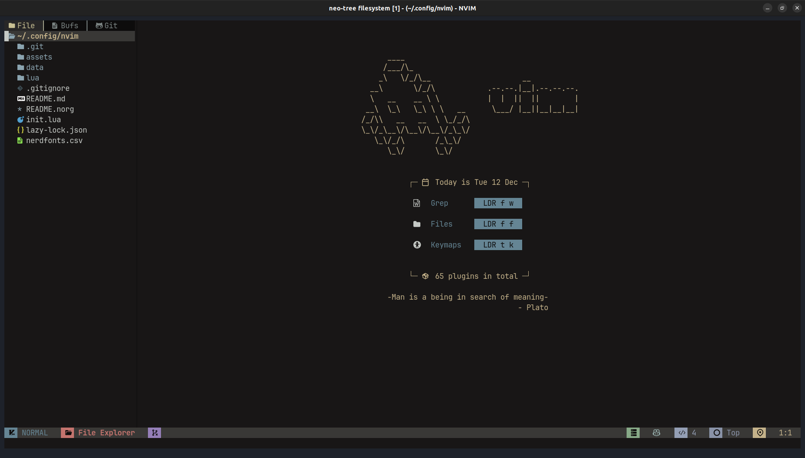
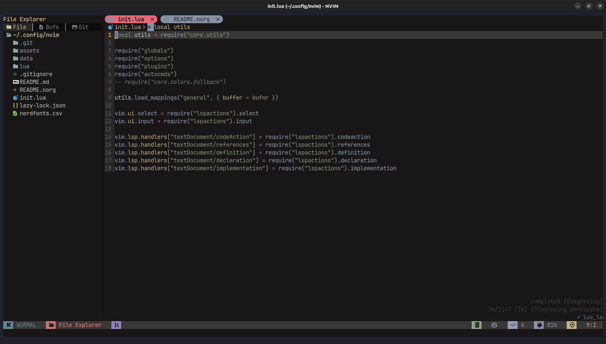
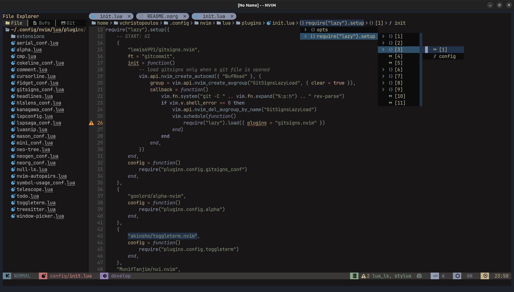
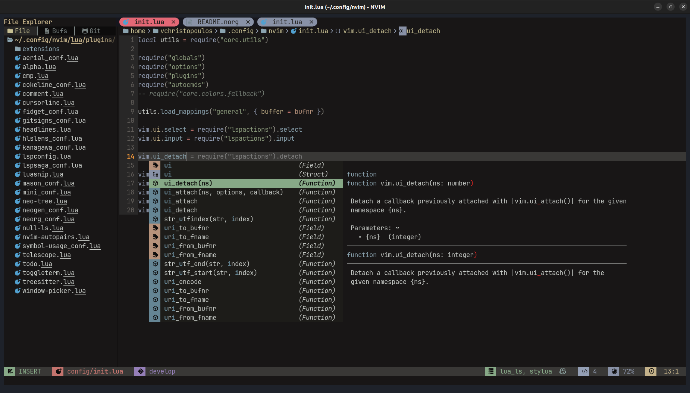
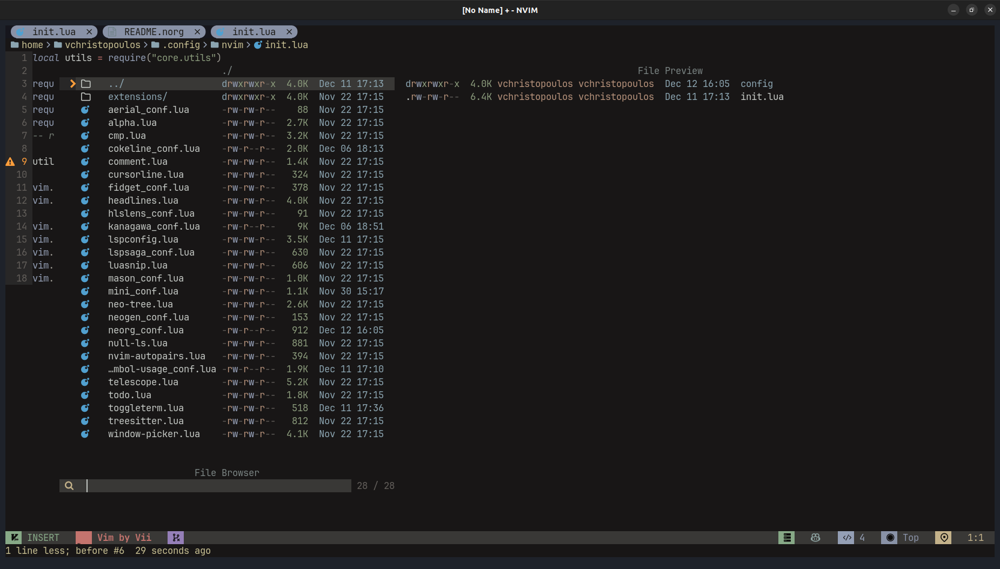
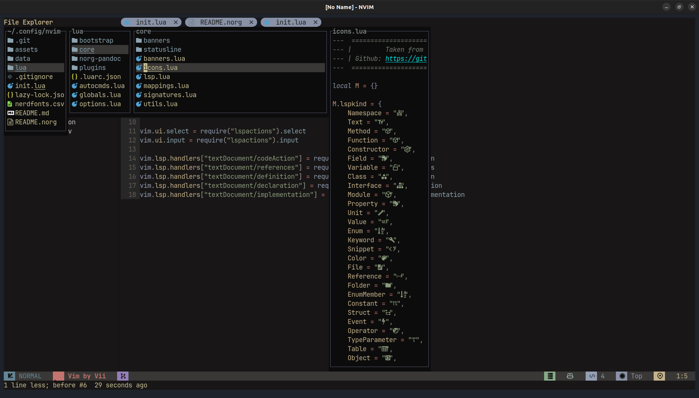

```document.meta
title: README
description: Neovim Config README
authors: vchristopoulos
categories: NeoVim
created: 2023-12-12T15:00:47+0200
updated: 2023-12-12T15:10:11+0200
version: 1.1.1
```

# Neovim Config

## Introduction

This is my personal configuration of **_neovim_** with the **mappings**
I'm more confurtable with and the **plugins** I like and use everyday.
I'll say it first, this config is not perfect by any means. It needs a
lot of fixes
and a lot of work but I am pretty happy with how it turned out up till
now. I'm working on it almost daily and I change/fix a lot of stuff that
are either buggy **or** I don't like.

If this config suites your needs feel free to clone it and use it (I
have installation instructions down below) or if you prefer the current
state of it and don't want any sudden changes you can fork it and work
from there, after that you can check if the commits I push are ok with
you and if so you can pull the changes to your own branch as well.

This configuration aims to be my daily IDE and contains configurations
from many different amazing people such us:

- [The LunarVim Project](https://github.com/LunarVim/LunarVim)

- [The NvChad Project](https://github.com/NvChad/NvChad)

- [The Dharmx Config](https://github.com/dharmx/nvim)

- [The Lvim Project](https://github.com/lvim-tech/lvim)

- [The OctoVim Project](https://github.com/OctoVim/OctoVim)

- And more that I'm probably forgetting.

I'm developing `web` and `mobile` apps daily so my configs are mostly
focused on those two areas.

This configuration is always updated with new staff, fixes ٩(◕‿◕｡)۶ and
features I steal... I mean borrow from other configs. I'm always trying
to keep it up to date with the latest and greatest plugins and features.
Do expect some breaking changes from time to time but I'll try to keep
them to a minimum as I occasionally look what other people have done to
get inspiration (and steal code). If you clone this config you may find
it looking quite different from whta the screenshots display below.

## Installation

Make sure you create a backup of your current config before you proceed
with the installation.

```sh
mv ~/.config/nvim ~/.config/nvim.bak
```

Then run the following command to clone the config.

```sh
git clone https://github.com/ViiEx/nvim.git ~/.config/nvim
```

## Dependencies

This config uses the following dependencies:

- `https://github.com/BurntSushi/ripgrep`(ripgrep)

- `https://github.com/sharkdp/fd` (fd)

- `https://www.nerdfonts.com`(Nerd Fonts)

- `https://www.nodejs.org` (NodeJS) You can install it with `nvm` or
  `fnm` as well.

## Features

- Many different banners taken from `KrakenNvim` a.k.a. `Dharmx Config`,
  and can be found under `./lua/core/banners` folder.

- Neotree file explorer.

- ToggleTerm for terminal.

- CMP for autocompletion.

- LSP for language server.

- LSP Saga for LSP features.

- Mason for lsp installations.

- Null Ls for formatting and linting.

- Telescope for fuzzy finding.

- Treesitter for syntax highlighting.

- Git signs for git changes.

- Custom statusline.

- Hovered diagnostics.

- CokeLine for bufferline/tabline.

- Fidget for visual lsp indicators.

- Mini.nvim for indentation guides, some animations, file-manager.

- Alpha-nvim for dashboard.

- Aerial.nvim for code outline.

- Todo for todo comments.

- Much more that awaits you to discover.

### Small guide to use Which-key

I don't use `Which-key` since I remember all my mappings but if you want
to use it you can do the following:

- First install the plugin

```lua
{
    -- ./lua/plugins/init.lua
    "folke/which-key.nvim",
    module = "which-key",
    keys = {"<leader>", '"', "'", "`"},
    config = function()
        require("plugins.config.which-key")
    end,
    init = function()
        require("core.utils").load_mappings "whichkey"
    end,
}
```

- Create a config file at the following path
  `./lua/plugins/config/which-key.lua` and add the folliwing.

```lua
local present, wk = pcall(require, "which-key")

if not present then
    return
end

local options = {

  icons = {
    breadcrumb = "»", -- symbol used in the command line area that shows your active key combo
    separator = "  ", -- symbol used between a key and it's label
    group = "+", -- symbol prepended to a group
  },

  popup_mappings = {
    scroll_down = "<c-d>", -- binding to scroll down inside the popup
    scroll_up = "<c-u>", -- binding to scroll up inside the popup
  },

  window = {
    border = "none", -- none/single/double/shadow
  },

  layout = {
    spacing = 6, -- spacing between columns
  },

  hidden = { "<silent>", "<cmd>", "<Cmd>", "<CR>", "call", "lua", "^:", "^ " },

  triggers_blacklist = {
    -- list of mode / prefixes that should never be hooked by WhichKey
    i = { "j", "k" },
    v = { "j", "k" },
  },
}

wk.setup(options)
```

- Add the keybindings to the `./lua/core/mappings.lua` file.

```lua
-- Again config taken from NvChad
M.whichkey = {
    plugin = true,

    n = {
        ["<leader>wK"] = {
            function()
                vim.cmd "WhichKey"
            end,
            "which-key all keymaps",
        },
        ["<leader>wk"] = {
            function()
                local input = vim.fn.input "WhichKey: "
                vim.cmd("WhichKey " .. input)
            end,
            "which-key query lookup",
        },
    },
}
```

## Theme

For theme I use `kanagawa` which is a fork of `tokyonight` and can be
found at `./lua/plugins/config/kanagawa_conf.lua`.

## Showcase








## Default (basic) keybindings

| **Keybind**   | **Description**             | **Mode** |
| ------------- | --------------------------- | -------- |
| \<C-b\>       | Go to the beginning of line | **_i_**  |
| \<C-e\>       | Got to the end of line      | **_i_**  |
| \<C-h\>       | move left                   | **_i_**  |
| \<C-l\>       | move right                  | **_i_**  |
| \<C-j\>       | move down                   | **_i_**  |
| \<C-k\>       | move up`                    | **_i_**  |
| \<C-h\>       | window left                 | **_n_**  |
| \<C-l\>       | window right                | **_n_**  |
| \<C-j\>       | window down                 | **_n_**  |
| \<C-k\>       | window up                   | **_n_**  |
| \<C-s\>       | save file                   | **_n_**  |
| \<C-c\>       | copy whole file             | **_n_**  |
| \<leader\>b   | new buffer                  | **_n_**  |
| \<C-n\>       | Open File tree              | **_n_**  |
| \<leader\>fe  | emoji explorer              | **_n_**  |
| \<leader\>gg  | ToggleTerm lazygit          | **_n_**  |
| <C-`>         | ToggleTerm horizontal split | **_n_**  |
| \<leader\>tt  | ToggleTerm horizontal split | **_n_**  |
| \<a-cr\>      | Code Action                 | **_n_**  |
| \<leader\>lr  | Lsp Rename                  | **_n_**  |
| \<leader\>lf  | Open floating diagnostics   | **_n_**  |
| \<C-/\>       | Comment toggle linewise     | **_n_**  |
| \<TAB\>       | goto next buffer            | **_n_**  |
| \<S-Tab\>     | goto prev buffer            | **_n_**  |
| \<leader\>x   | close buffer                | **_n_**  |
| \<leader\>ta  | Toggle aerial               | **_n_**  |
| \<leader\>gdh | Diff view file history      | **_n_**  |
| \<leader\>cb  | Set banner                  | **_n_**  |
| \<C-x\>       | escape terminal mode        | **_t_**  |

For even more keybindings check the `./lua/core/mappings.lua` file, or
use Telescope `<leader>tk` to see all the keybindings.
