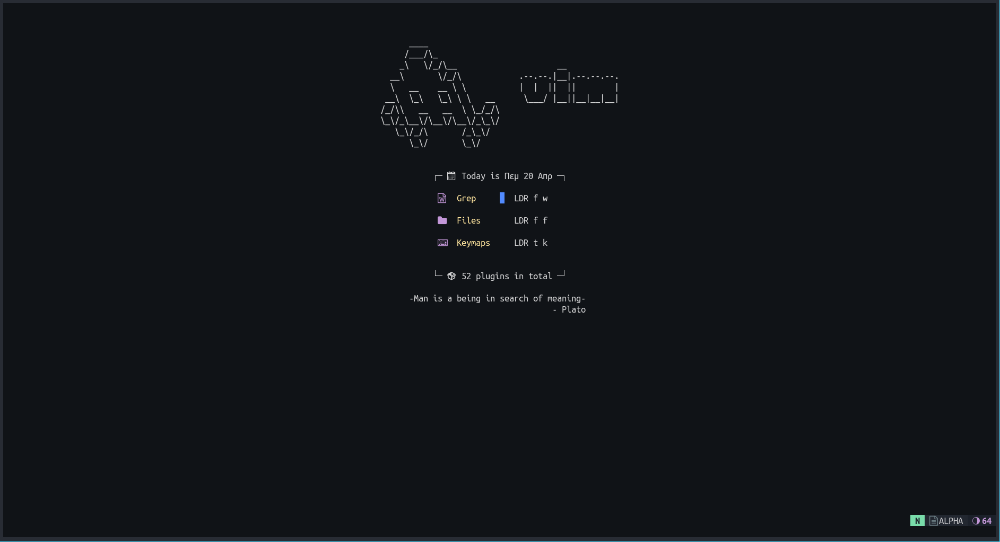
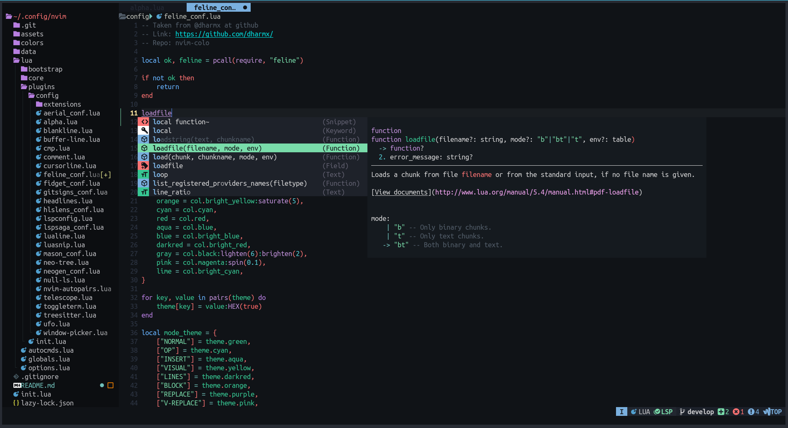
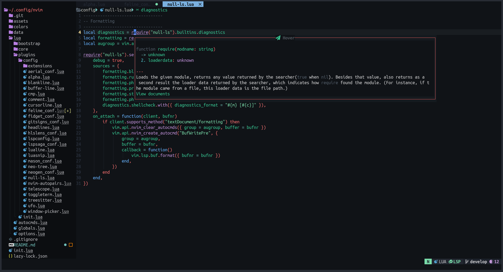
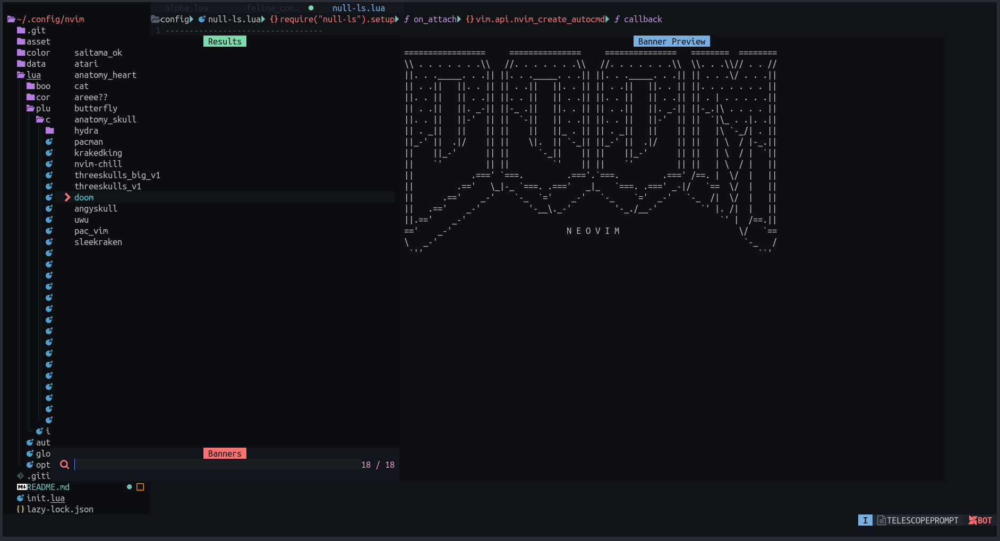

/_ -- My NeoVim Configuration -- _/

# Neovim Config

## Introduction

This is my personal configuration of `neovim` with the `mappings` I'm more confurtable with
and the `plugins` I like and use everyday. I'll say it first, this config is not perfect by any means. It needs a lot of fixes \
and a lot of work but I am pretty happy with how it turned out up till now. I'm working on it almost daily and I change/fix a lot of stuff
that are either buggy **or** I don't like.

If this config suites your needs feel free to clone it and use it (I have installation instructions down below)
or if you prefer the current state of it and don't want any sudden changes
you can fork it and work from there, after that you can check if the commits I push are ok with you and if so you can pull the changes to your
own branch as well.

This configuration aims to be my daily IDE and contains configurations from many different amazing people such us:

- [The LunarVim project](https://github.com/LunarVim/LunarVim)
- [The NvChad project and it's extensions](https://github.com/NvChad/NvChad)
- [KrakeNvim](https://github.com/dharmx/nvim)
- [Lvim](https://github.com/lvim-tech/lvim)
- [OctoVim](https://github.com/OctoVim/OctoVim)
- And more that I'm probably forgetting.

I'm developing `web` and `mobile` apps daily so my configs are surrounding this part the most.

This configuration is always updating with new staff, fixes (it needs a few or many ٩(◕‿◕｡)۶) and features I steal...
I mean borrowing from other people.
Do expect a lot of changes as I occasionally look what other people have done to get inspiration (and steal code).
If you clone this config you may
find it looking quite different from what the screenshots display below.

## Installation

Make sure you create a backup of your existing `NeoVim` config in case you already have one.

```sh
mv ~/.config/nvim ~/.config/nvim.back
```

Then run the following command.

```sh
git clone https://github.com/ViiEx/nvim.git ~/.config/nvim
```

## Features

There are many different banners taken from `KrakeNvim` that can be found at `./lua/core/banners.lua`.

In order to change the banner for Dashboard I have created a small telescope picker that lists and previews
all the banners. To use it type `<leader>cb` and select the banner you like. After that the next time you
open NeoVim the new banner will greet you.

I'm using `NeoTree` instaed of the `NvimTree` cause I find it really fancy and of course `ToggleTerm` for the terminals.

Many standar plugins such as `Cmp`, `LspConfig`, `Mason`, `Null-ls`, ~~Lualine~~ `Feline` and `Buffer Line`.

> Used to have `NvChad_ui` but it is a hustle to make it work properly here so I removed it.

The config includes by default `hovered diagnostics` cause they are so much more easier to read for me
so if you don't prefer it that way you can disable it
by commenting out the `autocmd` in the `./lua/plugins/init.lua` file under the `lspsaga` plugin.

I have telescope with emojis enabled cause I like using them as well.

Finally I don't use `Which-key` since I remember my keybindings but you can easily install it to help you.

### Small guide to use Which-key

First install the plugin

```lua
-- ./lua/plugins/init.lua

{
  "folke/which-key.nvim",
  module = "which-key",
  keys = { "<leader>", '"', "'", "`" },
  config = function()
    require("plugins.config.which-key")
  end,
  init = function()
    require("core.utils").load_mappings "whichkey"
  end,
}

```

Create a config file at the following location: `./lua/plugins/config/which-key.lua` \
and add the following.

```lua
-- The following is taken from NvChad
local present, wk = pcall(require, "which-key")

if not present then
  return
end

local options = {

  icons = {
    breadcrumb = "»", -- symbol used in the command line area that shows your active key combo
    separator = "  ", -- symbol used between a key and it's label
    group = "+", -- symbol prepended to a group
  },

  popup_mappings = {
    scroll_down = "<c-d>", -- binding to scroll down inside the popup
    scroll_up = "<c-u>", -- binding to scroll up inside the popup
  },

  window = {
    border = "none", -- none/single/double/shadow
  },

  layout = {
    spacing = 6, -- spacing between columns
  },

  hidden = { "<silent>", "<cmd>", "<Cmd>", "<CR>", "call", "lua", "^:", "^ " },

  triggers_blacklist = {
    -- list of mode / prefixes that should never be hooked by WhichKey
    i = { "j", "k" },
    v = { "j", "k" },
  },
}

wk.setup(options)
```

Add the keymappings to the `./lua/core/mappings.lua` file

```lua
-- Again config taken from NvChad
-- ....
M.whichkey = {
  plugin = true,

  n = {
    ["<leader>wK"] = {
      function()
        vim.cmd "WhichKey"
      end,
      "which-key all keymaps",
    },
    ["<leader>wk"] = {
      function()
        local input = vim.fn.input "WhichKey: "
        vim.cmd("WhichKey " .. input)
      end,
      "which-key query lookup",
    },
  },
}
-- ....
```

## Theme

For theme I use my fork of colo.nvim that you can clone under the `dev`
forlder for lazy or use it as any normal plugin (`ViiEx/colo.nvim`) but in
both cases make sure to use the `feature/neotree` branch.

## Showcase






## Default (basic) keybindings

| **Keybind**   | **Description**             | **Mode** |
| ------------- | --------------------------- | -------- |
| \<C-b\>       | Go to the beginning of line | **_i_**  |
| \<C-e\>       | Got to the end of line      | **_i_**  |
| \<C-h\>       | move left                   | **_i_**  |
| \<C-l\>       | move right                  | **_i_**  |
| \<C-j\>       | move down                   | **_i_**  |
| \<C-k\>       | move up`                    | **_i_**  |
| \<C-h\>       | window left                 | **_n_**  |
| \<C-l\>       | window right                | **_n_**  |
| \<C-j\>       | window down                 | **_n_**  |
| \<C-k\>       | window up                   | **_n_**  |
| \<C-s\>       | save file                   | **_n_**  |
| \<C-c\>       | copy whole file             | **_n_**  |
| \<leader\>b   | new buffer                  | **_n_**  |
| \<C-n\>       | Open File tree              | **_n_**  |
| \<leader\>fe  | emoji explorer              | **_n_**  |
| \<leader\>gg  | ToggleTerm lazygit          | **_n_**  |
| <C-`>         | ToggleTerm horizontal split | **_n_**  |
| \<leader\>tt  | ToggleTerm horizontal split | **_n_**  |
| \<a-cr\>      | Code Action                 | **_n_**  |
| \<leader\>lr  | Lsp Rename                  | **_n_**  |
| \<leader\>lf  | Open floating diagnostics   | **_n_**  |
| \<C-/\>       | Comment toggle linewise     | **_n_**  |
| \<TAB\>       | goto next buffer            | **_n_**  |
| \<S-Tab\>     | goto prev buffer            | **_n_**  |
| \<leader\>x   | close buffer                | **_n_**  |
| \<leader\>ta  | Toggle aerial               | **_n_**  |
| \<leader\>gdh | Diff view file history      | **_n_**  |
| \<leader\>cb  | Set banner                  | **_n_**  |
| \<C-x\>       | escape terminal mode        | **_t_**  |
